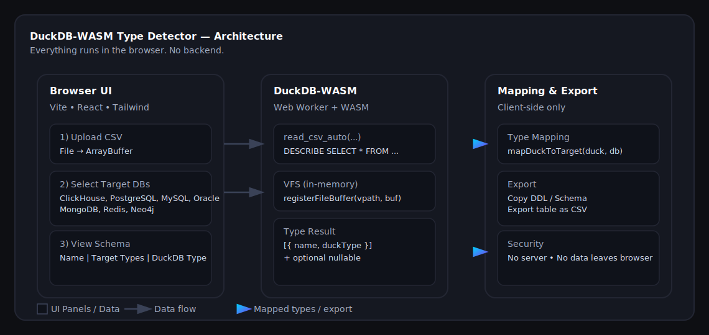

# 🦆 DuckDB WASM Type Detector

A beautiful web app built with **Vite + React + TypeScript + TailwindCSS** that uses **DuckDB-WASM** to detect column types in CSV files directly in your browser — no backend needed 🚀

> 💡 Perfect for analysts, data engineers, and developers who want to preview and map CSV schema to multiple databases quickly.

---

## ✨ Features

✅ **Detect column types locally** — uses DuckDB running entirely in your browser (WebAssembly).  
✅ **Multi-database mapping** — instantly converts DuckDB types to:
- ClickHouse  
- PostgreSQL  
- MySQL  
- Oracle  
- MongoDB  
- Redis  
- Neo4j  

✅ **CSV preview & schema table** — view all detected columns and their mapped data types.  
✅ **Copy or export** —  
- **Copy query** → copies generated DDL/CREATE TABLE for all selected databases.  
- **Export file as CSV** → downloads the detected schema as a `.csv` file.  
✅ **Zero server** — everything runs on the client-side.  
✅ **Deploy-ready** — works on Netlify, Vercel, GitHub Pages, etc.

---

## 🧩 Tech Stack

| Layer | Tech |
|-------|------|
| Core | [Vite](https://vitejs.dev/), [React](https://react.dev/), [TypeScript](https://www.typescriptlang.org/) |
| DB Engine | [@duckdb/duckdb-wasm](https://duckdb.org/docs/api/wasm) |
| UI | [TailwindCSS](https://tailwindcss.com/), [lucide-react](https://lucide.dev/) |
| Notifications | [sonner](https://ui.sonner.dev/) |
| Hosting | [Netlify](https://www.netlify.com/) |

---

🧠 How It Works

You upload a CSV file.

DuckDB-WASM runs locally and analyzes the file structure (DESCRIBE SELECT * FROM read_csv_auto(...)).

The app displays the detected columns and DuckDB types.

You select one or multiple target databases — and it instantly maps types for each (e.g. VARCHAR → text for PostgreSQL, String → String for ClickHouse).

You can:

🧾 Copy the generated DDL

💾 Export the current table as CSV

🧱 Project Structure
src/
 ├── components/
 │    └── DetectCSV.tsx        # Main UI
 ├── lib/
 │    ├── duckdb.ts            # DuckDB-WASM setup
 │    ├── typeMapping.ts       # Type mappings for multiple DBs
 │    └── ddl.ts               # DDL generation
 ├── index.css                 # Tailwind styles
 └── main.tsx                  # App entrypoint

🧰 Type Mapping Example

| DuckDB Type | ClickHouse | PostgreSQL | MySQL | Oracle | MongoDB | Redis | Neo4j |
|--------------|-------------|-------------|--------|---------|----------|--------|
| INTEGER | Int32 | integer | int | NUMBER(10) | Number | integer | Integer |
| VARCHAR | String | text | varchar(255) | VARCHAR2(255) | String | string | String |
| BOOLEAN | UInt8 | boolean | tinyint(1) | NUMBER(1) | Boolean | boolean | Boolean |
| TIMESTAMP | DateTime64 | timestamp | datetime(6) | TIMESTAMP | Date | string | DateTime |

## 🏗️ Architecture

Everything happens in the browser — no backend required.

  

**Flow:**
1. User uploads CSV → file stays in browser memory.
2. DuckDB-WASM (Web Worker) loads CSV via in-memory VFS and runs `read_csv_auto(...)`.
3. We read `DESCRIBE` result (`name`, `duckType`) and show a schema grid.
4. Selected target DBs are mapped on the fly with `mapDuckToTarget(...)`.
5. Export options:
   - **Copy query** — generate DDL / JSON schemas for selected DBs.
   - **Export file as CSV** — download the visible grid as CSV.

🧑‍💻 Credits

Built by @ashot0907

📜 License

MIT © 2025 Ashot